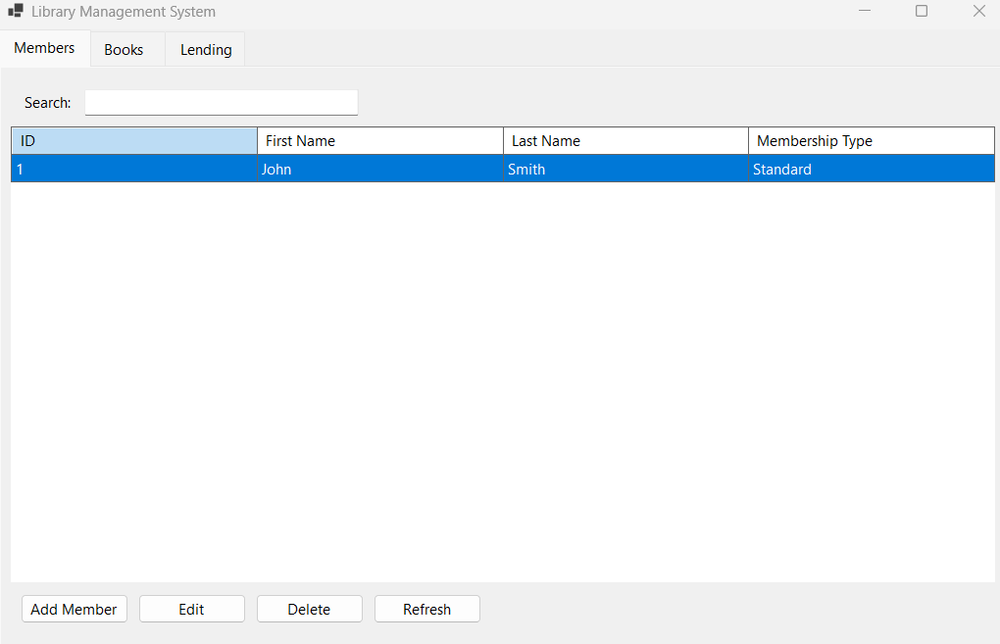
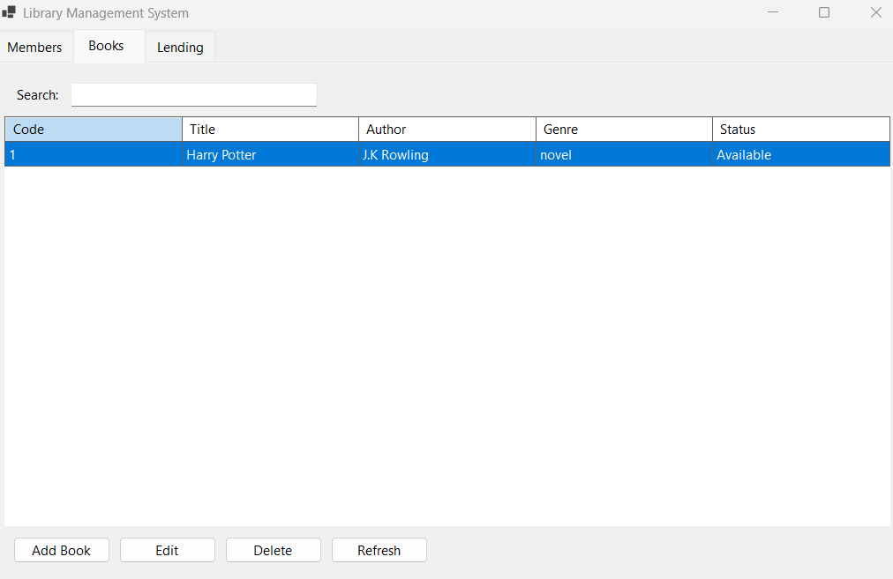
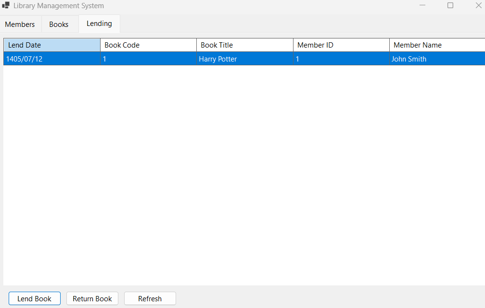
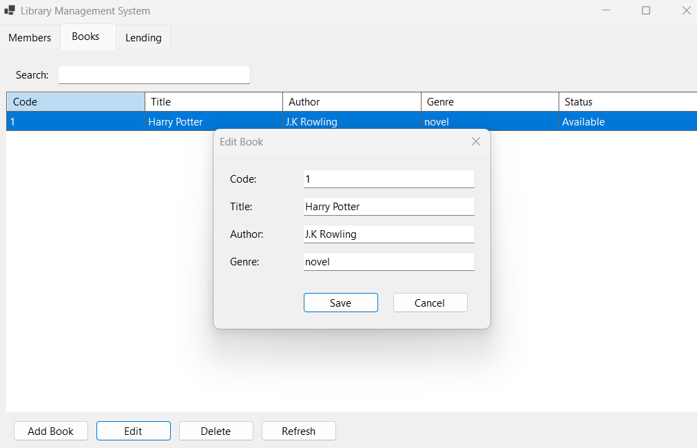

# Library Management System

A desktop library management app built with **C# WinForms (.NET 8)**,
using **Excel** (via [ClosedXML](https://github.com/ClosedXML/ClosedXML))
as the data store instead of a traditional database.

> Coursework project for _Advanced Programming_, term 2.

## Features

- **Books** — add, edit, delete, and search by code, title, author, or genre
- **Members** — add, edit, delete, and search by ID or name
- **Lending** — lend a book to a member and return it, with automatic
  availability tracking (a book can't be lent twice, a member/book must
  exist before lending)
- Data persisted to an Excel workbook (`LMS.xlsx`), created automatically
  on first run

## Screenshots

| Members                                     | Books                                   |
| ------------------------------------------- | --------------------------------------- |
|  |  |





## Project structure

```
Models/      Book, Member, Lending — plain data classes
Services/    BookService, MemberService, LendingService — business logic and validation
Data/        ExcelContext — reads/writes the Excel workbook
Exceptions/  AppException hierarchy (DuplicateException, NotFoundException, LendingException)
Forms/       BookForm, MemberForm, LendForm — add/edit dialogs
MainWindow   Main tabbed window (Members / Books / Lending)
```

Validation and business rules (duplicate IDs, lending an already-lent
book, deleting a book/member that currently has an active lending, etc.)
live in the `Services` layer and are surfaced to the UI as typed
exceptions, rather than being checked directly in the forms.

## Running it

Requirements: .NET 8 SDK, Windows (WinForms).

```bash
dotnet restore
dotnet run
```

On first launch, `LMS.xlsx` is created automatically in the working
directory with empty `Members`, `Books`, and `Lendings` sheets.

## Tech stack

- C# / .NET 8 / WinForms
- [ClosedXML](https://github.com/ClosedXML/ClosedXML) for Excel read/write
